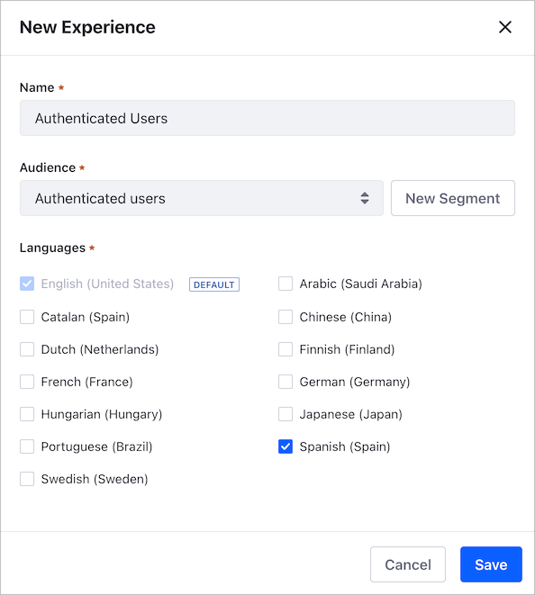
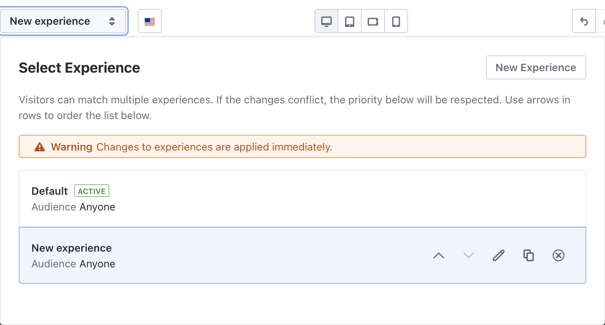

# Creating and Managing Experiences

> Some Experiences functionality is available in Liferay 7.4+, 7.3 Fix Pack 1+, and 7.2 Fix Pack 11+ only.

You can customize your Content Page to different groups of users using *Experiences*. To learn about Liferay DXP Experiences, see [Content Page Personalization](./content-page-personalization.md).

## Creating a New Content Page Experience

1. Go to *Site Administration* &rarr; *Site Builder* &rarr; *Pages*.

1. Click the Actions () menu and select *Edit*, or [create a new Content Page](../../creating-pages/adding-pages/adding-a-page-to-a-site.md).

1. At the top of the page, for the Experience click *Default* to open the Experience selection dialog.

    
1. Click *New Experience*.

1. Enter a name for the Experience and select the Segment for the audience you want to target, or [create a New Segment](../segmentation/creating-and-managing-user-segments.md) (available in Liferay DXP 7.2 Fix Pack 1+ and Liferay Portal 7.2 CE GA2+.)

    ```{note}
    New Experiences are assigned to the *Anyone* Segment by default and target all website visitors.
    ```

1. On the *New Experience* dialog, under the *Languages* section, select any additional language you want to target with your experience. For example, if your default Content Page language is en-US and you want to create an Experience for es-ES speakers, select this language as well.

    

1. Edit your Content Page with the information and layout you want to show to the selected Segment.

1. Using the Up () and Down () controls, move the Experience in the list to set its precedence (see [Understanding How Experiences Work](#understanding-how-experiences-work) for more information).
1. Click *Publish*.

The Default version of the page appears for everyone except for members of the selected Segment, who see a version of the site for their defined Segment.

## Managing Content Page Experiences

When you edit a Content Page, you can click on the Experience to manage the options for that page.



1. Go to *Site Administration* &rarr; *Site Builder* &rarr; *Pages*.
2. On the Content Page you want to edit, click the *Actions* () menu and select *Edit*.
3. Click on the Experience you want to manage. From here you can:

   - Set the Experience Priority, using the Up () and Down () controls.
   - Edit () the Experience's name, selected Segment or Language.
   - Duplicate () the Experience.
   - Delete () the Experience.

    ```{important}
    The order of your Experiences in the Experience selector determines the Experience precedence. See *Understanding How Experiences Work* in [Content Page Personalization](./content-page-personalization.md) for more information.
    ```

## Related Information

- [Content Page Personalization](./content-page-personalization.md)
- [Personalizing Collections](./personalizing-collections.md)
- [Creating and Managing User Segments](../segmentation/creating-and-managing-user-segments.md)
