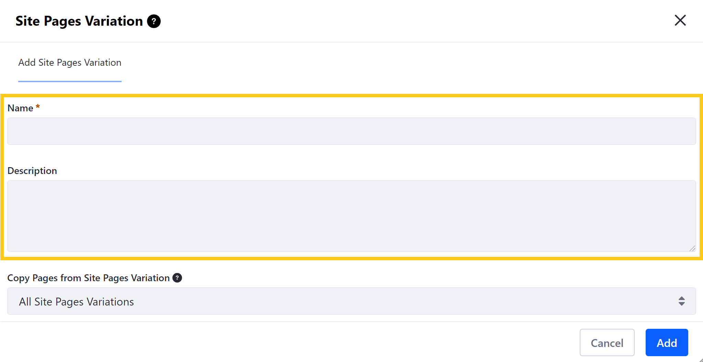
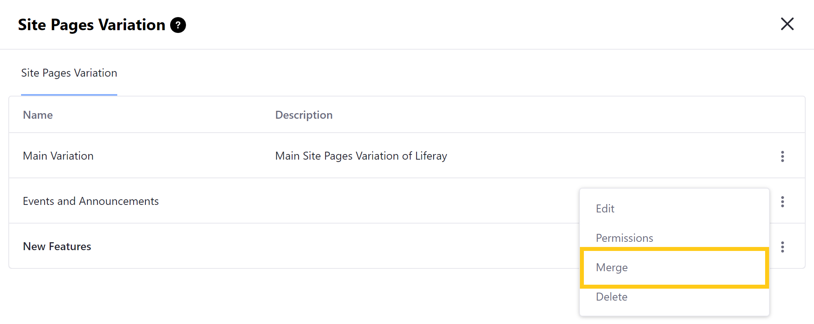

# Page Versioning

With Page Versioning enabled, you and your team can work in parallel on multiple versions of your Site's Pages and Page sets. These different versions are called *variations*, which you can create and manage for Widget Pages and Content Pages via the Staging bar. Page versioning also maintains a history that you can use to revert changes made to your staged Pages to earlier versions if needed.

```{note}
Starting with Liferay DXP 7.4, 7.3 Fix Pack 1, and 7.2 Fix Pack 11, you can create variations in Widget Pages and Content Pages. In previous Liferay DXP versions, you could create variations only on Widget Pages. To learn more about variations in these types of pages, see [Types of Variations](#types-of-variations).
```

You can enable Page versioning for your Private and Public Pages during initial Staging configuration, or anytime afterward via the *Staging Configuration* page. Once enabled, you can create, merge, and publish variations for individual Pages or Page sets. You can also manage variation permissions for different User Roles.

- [Page Versioning](#page-versioning)
- [Types of Variations](#types-of-variations)
- [Creating Variations](#creating-variations)
- [Merging Variations](#merging-variations)
- [Managing Variation Permissions](#managing-variation-permissions)
- [Additional Information](#additional-information)

## Types of Variations

When you enable *Page versioning* for a Page set, you can create and manage two types of variations in each Widget Page's Staging bar:

<<<<<<< HEAD
- **Site Pages Variation**: You can use variations of your Site's Page sets to modify multiple Pages while keeping them together as a set. You can create Site Page Variations on Widget Pages and Content Pages.
=======
* **Site Pages Variation**: You can use these variations of your Site's Page sets to modify multiple Pages while keeping them together as a set. You can create Site Page Variations on Widget Pages and Content Pages.
>>>>>>> parent of 7a746586d (LRDOCS-9165 cherry-pick commit.)

* **Page Variations**: Single Page variations that exist within Page set variations. You can create Page Variations on Widgets Pages only. To create different versions of a Content Page, use [Experiences](../../../site-building/personalizing-site-experience/experience-personalization/content-page-personalization.md).

   ```{tip}
   Page variations in Content Pages use [Experiences](../../../site-building/personalizing-site-experience/experience-personalization/content-page-personalization.md) and do not require the Staging tool. 
   ```

Both variation types only affect Pages and do not affect your Site's content, since all variations in your staging Site share the same content. That said, each variation can use and configure the same content and applications in different ways, and each variation of a Page set can have different Pages.

However, modifying the *layout type* or *friendly URL* of a Page does affect every Site Page variation. For example, if a Page template is modified, those modifications are propagated to the Pages configured to inherit changes from the template.

```{note}
Page templates are not recognized by the Staging framework. This means that existing Page templates are not viewable or editable on a staged Site. If they're created on a staged Site, they are lost if staging is disabled.
```

## Creating Variations

Follow these steps to create new variations of a Page or Page set:

1. Click on the *Actions* button (  ) in the Staging bar, and select *Site Pages Variation* (for Widget Pages or Content Pages) or *Page Variations* (for Widget Pages only).

   

1. Click on the *Add* button at the bottom right of the modal window.

   

1. Enter a *name* and *description* for your new variation. You can modify these fields for your variation at any time.

   

   For Page set Variations, you can also determine whether your new Page set variation copies Pages from existing variations by selecting from the following options:

   * **All Site Pages Variations**: Copy all existing Page variations into your new Page set variation.

   * **None (Empty Site Pages Variation)**: Create a new, empty Page set variation.

   * **[Existing Variations]**: Copy all existing Page variations from a single Page set variation.

   

   ```{note}
   If you decide to copy existing Page variations into your new Page set variation, only the latest version marked as ready for publishing is copied.
   ```

1. Click on *Add* to create your new variation.

Once created, you can switch between each version of a Page or Page set via the drop-down menus in the Staging bar. The *Page Variations* drop-down menu is available for Widget Pages only. For Content Pages, you create different versions using [Experiences](../../../site-building/personalizing-site-experience/experience-personalization/content-page-personalization.md). For more information, see [Site Staging UI Reference](./site-staging-ui-reference.md).


## Merging Variations

You can merge two Page set variations. This adds Pages and Page variations to a Page set variation without affecting or overwriting its content.

1. Click on the *Actions* button (  ) in the Staging bar, and select Site Pages Variation.

   

1. Click on the *Actions* button (  ) for the variation you want to use as the base for merging, and select *Merge*.

   

1. Select the variation you want to merge on top of the base variation.

   

When two variations of Site Pages are merged, new Pages that don't exist in the base variation are added to it. And if a Page exists in both variations, and at least one version of the Page is marked as ready for publishing, the latest version marked as ready is added as a new variation for its corresponding Page in the base variation. Older variations not marked as ready for publishing are not copied.

## Managing Variation Permissions

You can also set permissions for each variation, so certain users have access to manage some, but not all variations. See [Managing Staging Permissions](./managing-staging-permissions.md) for more information.

## Additional Information

* [Staging Overview](./staging-overview.md)
* [Configuring Local Live Staging](./configuring-local-live-staging.md)
* [Configuring Remote Live Staging](./configuring-remote-live-staging.md)
* [Site Staging UI Reference](./site-staging-ui-reference.md)
