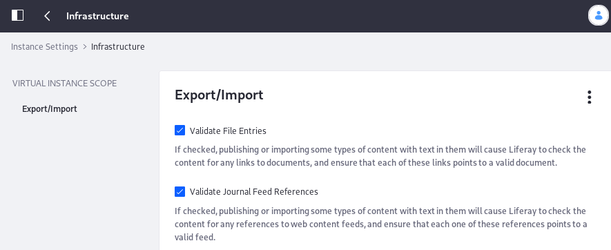

#  Infrastructure

The Infrastructure category contains settings to specify which content types are validated during the Import/Export process and whether to delete temporary LAR files during the Import/Export process. 

To access these settings, open the Control Panel and navigate to *Configuration* &rarr; *Instance Settings* and select *Infrastructure* under the Platform heading. 

| Configuration | Purpose |
| :--- | :--- |
| Validate File Entries | If checked, publishing or importing some types of text content causes Liferay DXP to check the content for links to documents and ensure that each link points to a valid document. |
| Validate Journal Feed References | If checked, publishing or importing some types of text content causes Liferay DXP to check the content for references to web content feeds, and ensure that each reference points to a valid feed. |
| Validate Layout References | If checked, publishing or importing some types of text content triggers validation of links that reference a Liferay DXP virtual host, ensuring that each link points to a valid page within the portal. Uncheck this if your virtual host has pages outside of Liferay DXP. |
| Validate Missing References | If checked, publishing or importing triggers a check for missing references. If unchecked, missing reference validation is skipped and references without existing targets can be published or imported to the target site. |
| Delete temporary LAR during a failed staging publication process. | Uncheck to avoid deleting the temporary LAR during a failed staging publication process. In remote staging contexts, this only applies to the staging environment. |
| Delete temporary LAR during a successful staging publication process. | Uncheck to avoid deleting the temporary LAR during a successful staging publication process. In remote staging contexts, this only applies to the staging environment. |
| Use the virtual host of the remote site. | The remote environment's virtual host is used when accessing the remote live site from the staged site. |