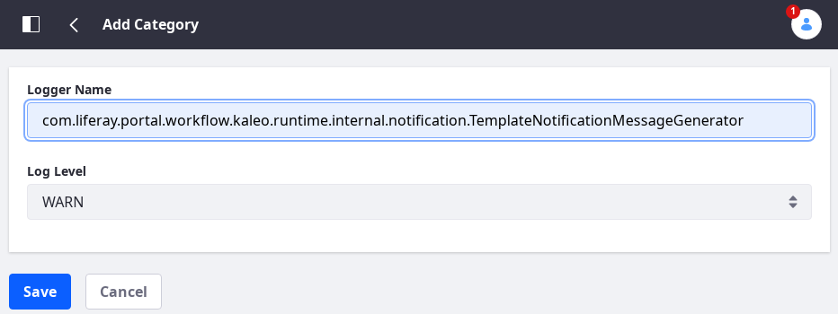

# Configuring Logging

In the Server Administration panel's Log Levels tab, you can set logging levels for classes and packages in Liferay DXP's class hierarchy and add custom objects to be similarly managed using the Server Administration logging UI. Changes to the log level near the top of the class hierarchy (such as at `com.liferay`) also change log levels for all the classes under that hierarchy. Modifications unnecessarily high in the hierarchy generate too many messages to be useful.

```{tip}
If your changes produce more log messages, make them as specific as possible.
```

Each logging configuration is referred to as a Category.

## Adding a Class or Package to the Log Levels User Interface

To add a category,

1. Navigate to Control Panel &rarr; Configuration &rarr; Server Administration, and click the _Log Levels_ tab.

1. Open the Add Category form by clicking the Add button .

1. Fill out the form and click *Save*.

1. Click _Save_.

*Logger Name*: A class deployed on the server, such as `com.liferay.portal.workflow.kaleo.runtime.internal.notification.TemplateNotificationMessageGenerator`

*Log Level*: Choose the logging level you'd like to see: OFF, FATAL, ERROR, WARN, INFO, DEBUG, TRACE, or ALL.



For a description of the logging levels, refer to [Apache's Log4j `Level` class Javadoc](https://logging.apache.org/log4j/1.2/apidocs/org/apache/log4j/Level.html).

## Changing the Log Level of an Existing Category

To change the log level of an existing logging configuration,

1. Navigate to Control Panel &rarr; Configuration &rarr; Server Administration, and click the _Log Levels_ tab.

1. Browse to or search for the category to configure.

1. Use the selector to change the level.

1. Click _Save_.


