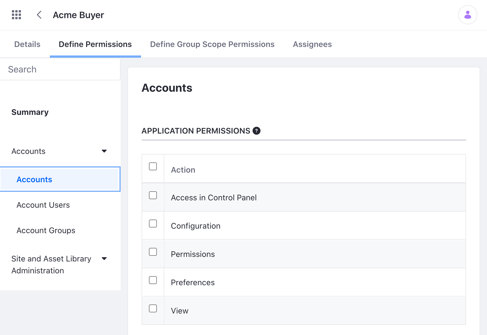

# Account Roles

You can create different Account Roles and define specific permissions for each one. Then assign these roles to different [Account Users](./accounts/account-users.md) to grant appropriate access to their [Accounts](../accounts.md). 

Note that Account Roles are assigned to a user for each specific Account. This offers great flexibility in managing users. For example, a user might have a "Buyer" role for Account "A" but not have that role for Account "B".

```{note}
Accounts is a feature that is available in Liferay DXP 7.4 and above.
```

## View Account Roles

There are two types of Account Roles: Shared and Owned. Shared type Account Roles are roles that are available across all Accounts in a DXP Instance. Owned type Account Roles are roles that are created and managed within a specific Account.

### View Shared Account Roles

To view an instance wide role, 

1. Open the Global Menu (). Navigate to *Control Panel* &rarr; *Roles*.

1. Click the *Account Roles* tab and view the list of available roles.

### View Owned Account Roles

To view an Account specific role,

1. Open the Global Menu (). Navigate to *Applications* &rarr; *Accounts*.

1. Click on the specific Account you wish to view. Click the *Roles* tab and view the list of available roles.

## Creating a New Account Role

Make a choice to create an Shared Account Role or an Owned Account Role.

### Creating and Assigning a Shared Account Role

To create a Shared Account Role,

1. Open the Global Menu (). Navigate to *Control Panel* &rarr; *Roles*.

1. Click the *Account Roles* tab. Click the Add icon ().

1. Give the new role a title and description. Click *Save* to create the role. 

    

1. Click the *Define Permissions* tab at the top of the page. Select what permissions the role has to act upon the resources owned by the account, including the account itself. For example, selecting the Update permissions would give the role the ability to change the Account's description. Click *Save* to save the permissions.

1. Click the *Define Group Scope Permissions* tab. Select what permissions the role has to act on resources owned by other groups (i.e. sites, channels, asset libraries, etc.). Note that the permissions apply for the account that is [selected as the current account](./account-management-widget.html#using-the-acconut-management-widget).  

1. To assign an account user to this role, navigate to *Applications* &rarr; *Accounts*. Select a specific account. 

1. Click the *Roles* tab and click the Options icon () of the role you just created. Click *Assign Users*.

    

1. Click the Add icon () and assign a user to this role.

### Creating and Assigning an Owned Account Role

To create an Owned Account Role, 

1. Open the Global Menu (). Navigate to *Applications* &rarr; *Accounts*.

1. Select the specific account in which to create the new role. Click the *Roles* tab and click the Add icon ().

1. Give the new role a title and description. Click *Save* to create the role.

1. Click the *Define Permissions* tab at the top of the page. Select what permissions the role has to act upon the resources owned by the account, including the account itself. For example, selecting the Update permissions would give the role the ability to change the Account's description. Click *Save* to save the permissions.

    

1. Click the *Define Group Scope Permissions* tab. Select what permissions the role has to act on resources owned by other groups (i.e. sites, channels, asset libraries, etc.). Note that the permissions apply for the account that is [selected as the current account](./account-management-widget.html#using-the-acconut-management-widget).   

2. To assign an account user, click the *Assignees* tab. Click the Add icon () and assign a user to this role.