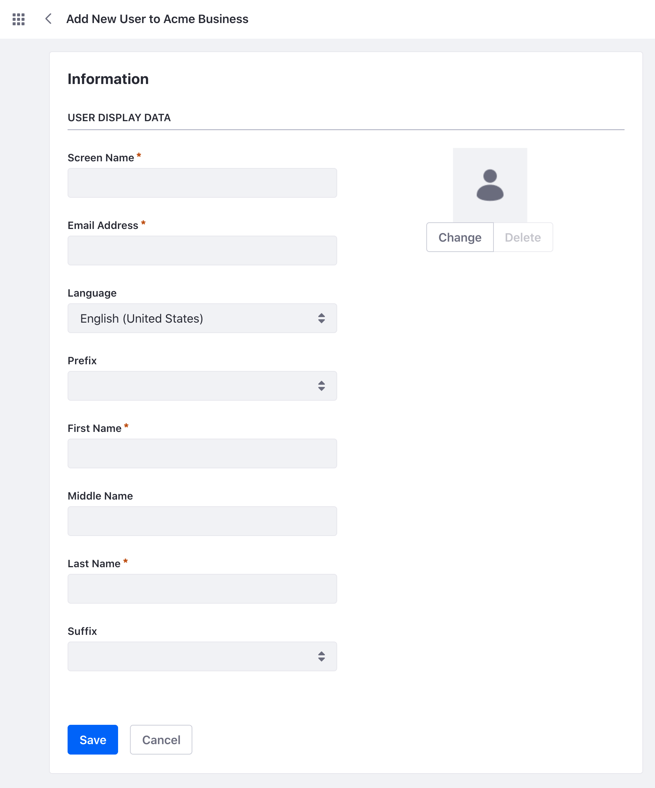

# Account Users

> Available: Liferay DXP/Portal 7.4+

Account Users are User accounts that are associated with a Business Account or a Person Account.

## Adding an Account User

1. Open the Global Menu (). Navigate to *Applications* &rarr; *Account Users*.

1. Click the _Add_ icon () to create a new Account User. 

1. Select the Account to associate with User. 

1. Fill in the necessary information for this new User.

   

   Click the *Save* button to save the new account user.

```{note}
Users for Accounts can only be created within this *Account Users* interface. A regular DXP User that is created in the *Users and Organizations* interface cannot be associated with any Accounts. However, an Account User can be managed and edited from *Users and Organizations* after creation.
```

### Setting a Password for an Account User

When you create an Account User, Liferay DXP generates a password for the User, using the [mail server](../../installation-and-upgrades/setting-up-liferay/configuring-mail.md) to send an email message with the User's new password.

If you haven't set up a mail server, set a password manually for the User.

1. In Account Users, click on the _Options_ icon () of the Account User you want to edit.

1. Under the General tab, click *Password*. Set a password and click *Save*.

## Editing an Account User

1. In Account Users, click the _Options_ icon () of the account user you want to edit.

1. Click *Edit* to see the Edit User page.

The following options are available in the Edit User page:

| General Tab | Description |
| :--- | :--- |
| Information | Edit or change the user's personal information. |
| Accounts | View or modify the User's associated accounts. |
| Password | Add or change the user's password. |

| Contact Tab | Description |
| :--- | :--- |
| Addresses | Add or change the user's addresses. |
| Contact Information | Add or change the user's contact information |

| Preferences Tab | Description |
| :--- | :--- |
| Alert and Announcements Delivery | Change the user's notification settings. |
| Display Settings | Change the user's time zone and greeting settings. |

## Deactivating and Deleting an Account User

Deleting an Account User is a two-step process: 

* You may decide that you want to keep the Account User after all.
* There may be user data that is tied with [legal requirements](../managing-user-data.md) you need to address. 
* You may require more time to review a User's account before deletion.

For these reasons and more you must first deactivate an Account User before deleting an Account User.

### Deactivating an Account User

Deactivating an Account User prevents the User from logging in, but still preserves the User's data and information. 

1. In Account Users, click the _Options_ icon () of the account user you want to edit.

1. Click *Deactivate* and click the *OK* button to confirm your change. The Account User is now deactivated. 

To see a deactivated User, click the *Filter and Order* drop-down menu and click *Inactive* under Filter by Status. You can click a User's Options icon () and click *Activate* to reactivate the User.

### Deleting an Account User

1. In Account Users, click the *Filter and Order* drop-down menu and click *Inactive* under Filter by Status.

1. Click the inactive User's _Options_ icon () and click *Delete*

   

1. Click *OK* on the pop-up form to confirm your decision. The Account User is now deleted.

## Impersonating an Account User

You can impersonate Account Users to view the system as they would see it. This helps to diagnose permission issues an administrator can't see, such as making sure a User doesn't have access to restricted data. Note, only Users with this permission can impersonate a different User.

1. In Account Users, click the Account User's _Options_ icon (). 

2. Click *Impersonate User* and a new window opens with you logged in as that Account User.
