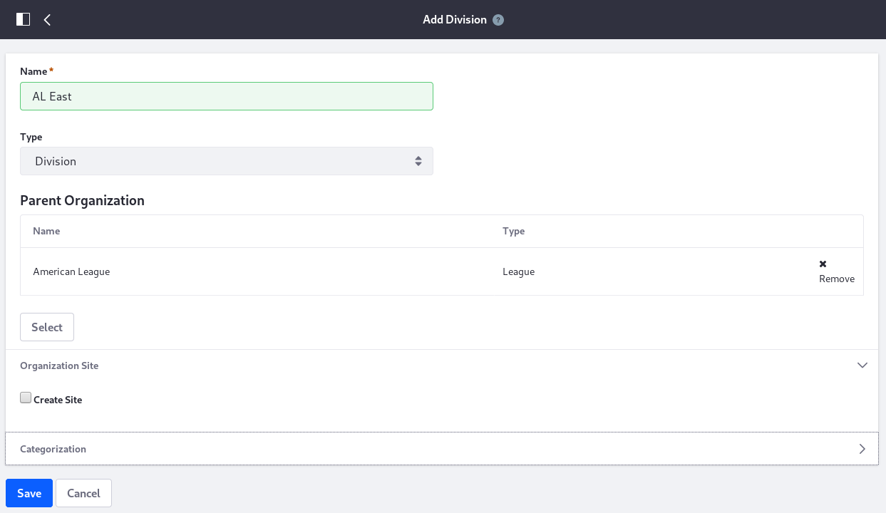

# Adding a New Organization Type

By default, Liferay DXP only includes the *Organization* type. You can configure the existing type or add additional types in System Settings &rarr; Users &rarr; Organization Type. There are two main reasons to configure Organization types:

1. Organizations usually correlate to real-life hierarchical structures. Calling them by their real names is helpful for administrators and Users. For example, in a baseball organization, you might want *League*, *Division*, and *Team* Organization types.
1. Enforce control over which Organizations can be top level Organizations and the type of sub-Organization allowed for each parent Organization type. For example, a baseball organization would not allow Division Organization types to be sub-Organizations of Team Organizations.

Check out the configuration options that configure the default *Organization* type and then configure an additional type.

To add another Organization type called *League*, enter these options into the configuration form:

| Org Name | Country Enabled | Country Required | Rootable | Children Types |
| :--- | :--- | :--- | :--- | :--- |
| League | True | False | True | Division |
| Division | True | False | False | Team |
| Team | True | False | False | [blank: leaf node] |

**Name:** Enter the name of your Organization type.

**Country Enabled:** Enables the Country selection list field on the form when adding or editing Organization types.

**Country Required:** Specifies that the *Country* field is not required when adding one of these Organization types.

**Rootable:** Enables this type as a top level Organization. Note that Division and Team above are both False, because they must be children of Leagues.

**Children Types:** Specifies the allowable sub-Organization types for this parent type. As above, Divisions can only be children of Leagues, and Teams can only be children of Divisions.

Once you configure additional Organization types and click Save, you'll find your new type(s) available for selection in the Add Organization form.

Users can join or be assigned to Sites when they share a common interest. Users can be assigned to Organizations when they fit into a hierarchical structure. User groups provide a more *ad hoc* way to group Users than Sites and Organizations.
