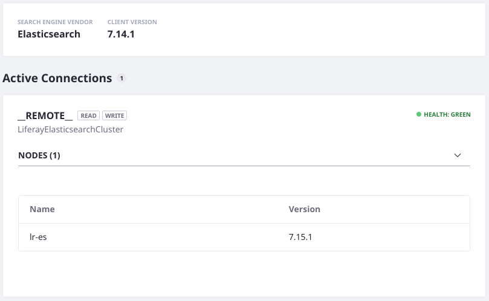
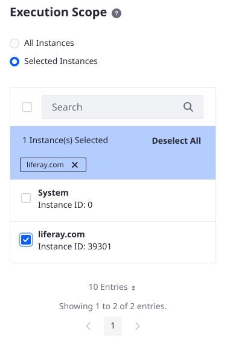

# What's New in Search for 7.4?

There are several highlights and new features added to Liferay's search infrastructure for the 7.4 release. New features include those added to the product for Liferay CE 7.4 GA4 and Liferay DXP 7.4 GA1.

## Elasticsearch 7 Integration

Elasticsearch 7 is supported in Liferay 7.4. Check the [Search Engine Compatibility Matrix](https://help.liferay.com/hc/en-us/articles/360016511651) for the latest information, including the minimum supported version, the client version, and the latest supported Elasticsearch version.



```{important}
Elasticsearch 6.x is not supported on Liferay CE/DXP 7.4.
```

## Search Infrastructure & Administration

### Re-Index Virtual Instances Independently

Beginning in Liferay 7.4, Server Administrators can limit the scope of the re-index actions to specific [Virtual Instances](../../system-administration/configuring-liferay/virtual-instances/understanding-virtual-instances.md). To choose which instances the index actions apply to,

1. Open Global Menu &rarr; Control Panel &rarr; Search and click the Index Actions tab.
1. Use the Execution Scope tab to choose the instances to re-index.

   

## Search Widgets

### Searching for Liferay Objects

To support searching for [Liferay Objects](../../developing-applications/developing-low-code-applications/objects.md), some search widgets have been enhanced:

* The Type Facet automatically includes published Objects:

   

* The Search Results widget automatically displays the Object Entry's title and a summary.

   

<!-- * If configured in the Object, a display page can be shown when the Object Entry is clicked in Search Results. -->

<!-- TODO: To learn more about Liferay Objects and search, read [Searching for Object](LINK). -->

## Search Tuning

> **DXP Subscribers**

### Search Tuning Data is Stored in the Database

Beginning in DXP Liferay 7.4, the Result Rankings and Synonym Sets data is stored in the Liferay database, and a re-index action from the Search Administration panel can be used to populate each application's index with the proper data. In prior versions the indexes were used as primary data storage for these applications.

To learn about how this impacts the upgrade process, read [Upgrading Search Infrastructure](../installing-and-upgrading-a-search-engine/elasticsearch/upgrading-elasticsearch/upgrading-search-infrastructure.md) and [Backing Up Elasticsearch](../installing-and-upgrading-a-search-engine/elasticsearch/upgrading-elasticsearch/backing-up-elasticsearch.md).


## Liferay Enterprise Search (LES)

> **[LES Subscribers](https://www.liferay.com/products/dxp/enterprise-search)**

### LES Installation is Simplified

Starting with Liferay DXP 7.4, the [Liferay Enterprise Search (LES)](../liferay_enterprise_search.md) applications are included with all Liferay DXP bundles and Docker containers. LES is enabled by default and requires no additional installation steps. However, a LES add-on subscription must be purchased to receive official Liferay Support and additional benefits. Maintenance and updates to LES applications are delivered with Liferay DXP updates.


## Upgrading to DXP 7.4

Upgrading from a previous DXP version to 7.4 requires no special considerations for most setups. If using Liferay Enterprise Search or Search Tuning, however, make sure you consider these points:

1. The Search Tuning applications are now backed by database tables, whereas previous versions used Elasticsearch indexes for their data storage. See [Upgrading Search Infrastructure](../installing-and-upgrading-a-search-engine/elasticsearch/upgrading-elasticsearch/upgrading-search-infrastructure.md) for more information.
1. The Liferay Enterprise Search applications are bundled with Liferay DXP. When upgrading to 7.4 no additional installation steps are required.

## Related Topics

* [Upgrading Search Infrastructure](../installing-and-upgrading-a-search-engine/elasticsearch/upgrading-elasticsearch/upgrading-search-infrastructure.md)
* [7.4 Breaking Changes](../../liferay-internals/reference/7-4-breaking-changes.md)
