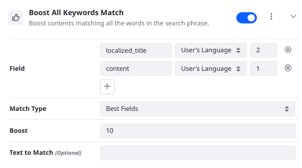
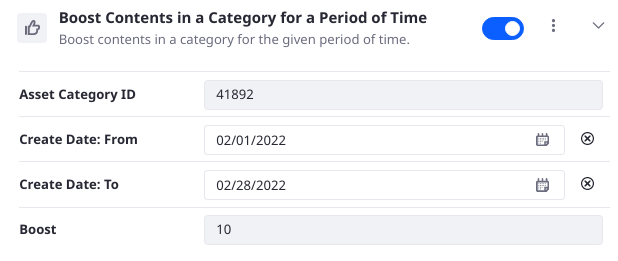
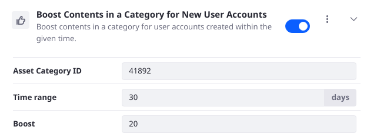
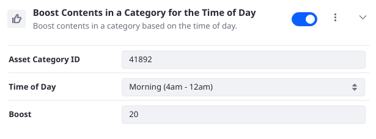
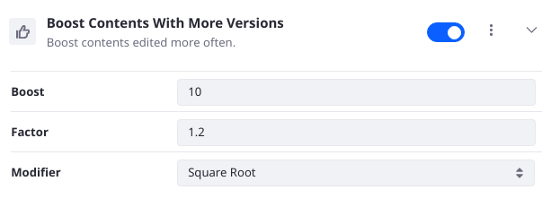

# Search Blueprints Elements Reference

Elements are one of the building blocks of a [Search Blueprint](understanding-search-blueprints.md#what-is-a-blueprint).

<!-- Hide Hidden Contents, Scheduling Aware, Staging Aware, Limit Search to HEAD Version:  This Element duplicates the functionality of a Liferay Search Framework query clause. -->

What should we show for each Element? JSON, screenshot of configuration screen?

To see the JSON representation for any Element, click the Actions icon () &rarr; View Element JSON.

Each Element can be disabled or enabled in the Blueprint using the toggle switch in the Title Bar of the Blueprint. For a streamlined view of the Elements in the Blueprint, you can collapse the contents of an Element using the Down Arrow Icon () in the Title Bar of the Element.

Each Element has configuration options, many of which directly correspond to attributes of the query as defined in the Elasticsearch [Query DSL documentation](https://www.elastic.co/guide/en/elasticsearch/reference/7.x/query-dsl.html). Links to specific query types are provided below as appropriate.

## Boost Some Results

When boosting certain results, the boost value will need tuning to meet your specific needs. Use the [Preview Sidebar](creating-and-managing-search-blueprints.md#testing-a-blueprint-with-the-preview-sidebar)  to inspect how the documents are being scored and to fine-tune your boost values.

**Boost All Keywords Match:** Use a Multi-match query to boost results if the search keywords match in the given fields. You can boost the Element's Multi-match query clause as a whole, and you can boost a match to each individual field. The _Text to Match_ configuration field is optional: if left blank, the search user's keywords are passed into the query.



_External Reference_: See the Elasticsearch [Multi-match](https://www.elastic.co/guide/en/elasticsearch/reference/7.x/query-dsl-multi-match-query.html) query documentation.

**Boost Asset Type:** Boost the given asset type. Select the Asset Type (required) from a list of registered [Assets](../../../building-applications/data-frameworks/asset-framework.md) and configure the boost value.

**Boost Contents for the Current Language:** Boost contents having a default language matching the current session language. Configure the boost value.
<!-- explain what it means to have a default language? -->

**Boost Contents in a Category by Keyword Match:** Boost contents in a category if the user's search keywords contain any of the configured keywords. The Keywords and Asset Category ID are required.
<!-- How do I find the Asset Category ID? This is ugly to have to document. Can't we provide a user friendly dropdown list of categories, like we do for Asset Entries in the Boost Asset Type Element? -->

You can query the Elasticsearch index (using Kibana, for example) to find the search document for the Asset Category, which will include it's `assetCategoryId`. In this case the Category being search has the title _business_:

```json
GET /_search
{
  "query": {
    "multi_match": {
      "fields": [
        "localized_title_en_US",
        "title_en_US",
        "title"
      ],
      "query": "business"
    }
  }
}
```

```{tip}
If you're not sure whether the field to search for is localized or not, use a Multi-match query as in the above snippet to search multiple variations of the field.
```

Users with the proper permissions can find the Asset Category ID by navigating to the Site Menu &rarr; Categorization &rarr; Categories. Ope the Category and check out its URL. For example,

<http://localhost:8080/group/guest/~/control_panel/manage/-/categories_admin/vocabulary/41891/category/41892>

The ID you need is the last part of the URL: `41892` in this case.

**Boost Contents in a Category for a Period of Time:** Boost contents in a category for the given period of time. The Asset Category ID, the start time, and the end time are all required. This Element is conditional: if the current date is outside of the configured date range, the query and its boost is not executed.



**Boost Contents in a Category for a User Segment:** Boost contents in a category for users belonging to the given [User Segments](../../../site-building/personalizing-site-experience/segmentation/creating-and-managing-user-segments.md). If entering more than one User Segment ID, enter a comma into the text box to begin entering the next ID. The Asset Category ID and the User Segment IDs are required fields. This is a conditional Element: the query is executed and boosted only if the `user.active_segment_entry_ids` contains the given Segment IDs.


<!-- We messed up the title and description for these in the UI--it should be plural but it sounds like its for only one Segment. -->

**Boost Contents in a Category for Guest Users:** Boost contents in a category if a user is not logged in. The Asset Category ID is required. This is a conditional Element, in that its query is only executed and boosted if the `user.is_signed_in` parameter is `false`.

**Boost Contents in a Category for New User Accounts:** Boost contents in a category for user accounts created within the given time. The Asset Category ID and the Time range (in number of days) are required. An account created within the given number of days is considered a new account, and certain results are boosted for these Users. This is a conditional Element: the query is executed and boosted only if the `user.create_date` parameter has a value within the given Time range.



**Boost Contents in a Category for the Time of Day:** Boost contents in a category based on the time of day. Select one of these time ranges:

- Morning: 4AM-12PM
- Afternoon: 12PM-5PM
- Evening: 5PM-8PM
- Night: 8PM-4AM



<!-- There's a typo here: morning says 4AM-12AM -->
<!-- Also, we should talk about Time Zone -->

**Boost Contents in a Category:** Boost and promote contents in a given category. The Asset Category ID is required.

**Boost Contents on My Sites:** Boost contents on sites the user is a member of. There are no required fields in this Element; as with other boosting Elements, configure the Boost value as desired. The Search Context contains a parameter `user.group_ids` to track the current User's groups, and if the current site's ID is part of that list, the query matches and the boost is applied.

<!-- I made a guess based on the JSON -->

**Boost Contents With More Versions:** Boost results that have more versions. This Element executes a Function score query using a `field_value_factor` function on the `versionCount_sortable` keyword field. The Factor and the Modifier are required and are configurable in the Element. The combination of the Factor, Modifier, and the version count determine how a result is boosted.



- Factor: Set the factor to multiply the field value by; defaults to 1.2.
- Modifier: Use a modifier to apply to the field value; default to Square Root. Other options include None, log, log1p, log2p, ln, ln1p, ln2p, Square, or Reciprocal.

_Example:_ If the version count for a document was `8`, and the default values were used in the Element, the score for the document is calculated as 

`sqrt (1.2 * 8)`

Therefore this document will have a score of about `3` added to it because of this Element.

_External Reference:_ See the Elasticsearch [Function score query](https://www.elastic.co/guide/en/elasticsearch/reference/7.x/query-dsl-function-score-query.html) documentation.

Might need an explanation of this one. The presence of a `boost: 10` throws me off here:

```json
{
	"queryConfiguration": {
		"queryEntries": [
			{
				"clauses": [
					{
						"context": "query",
						"occur": "should",
						"query": {
							"function_score": {
								"field_value_factor": {
									"missing": 1,
									"factor": 1.2,
									"field": "versionCount_sortable",
									"modifier": "sqrt"
								},
								"boost": 10
							}
						}
					}
				]
			}
		]
	}
}
```

**Boost Freshness:** Boost contents modified recently using a Gaussian function.


copied from the personalizing doc for now--might be useful:
   ```{note}
   The Gaussian function used to score documents by their proximity to the sending IP address might need to be adjusted. The Boost Proximity Element lets you adjust the decay, scale, and boost:

   - Decay defines the factor by which to reduce the boost value when the proximity of the asset to the User is equal to the scale.

   - Scale is the distance away from the User's IP adress location, above which the relevance of results should begin to deteriorate.

   - Boost is the numeric value to boost results that are within the defined scale.

   For example, if you specify a boost of 100 for search results geolocated to within 10 km of the User, and define a decay factor of 0.5, a result exactly 10 km away from the User will receive half of the maximum boost value, so it will be boosted by 50. At distances greater than 10 km, the Gaussian function takes over in determining the remaining scores.

   See [Elastic's Function Score Query](https://www.elastic.co/guide/en/elasticsearch/reference/7.x/query-dsl-function-score-query.html) documentation for more details.
   ```
**Boost Longer Contents:** Boost contents with longer content in the user's current language.

**Boost Proximity:** Boost contents in closer proximity to the search user with a Gaussian function. Additional setup is required.

**Boost Tagged Contents:** Boost contents having at least one of the given tags.

**Boost Tags Match:** Boost contents with an exact keyword match to a tag.

**Boost Web Contents by Keyword Match:** Boost certain Web Content if the user's search keywords contain the given keywords.

## Filter Results

**Filter by Exact Terms Match:** Filter results by one or multiple terms. At least one must match.

**Limit Search to Contents Created Within a Period of Time:** Limit search to contents created within the given time range.

**Limit Search to HEAD Version:** Limit the search to return only the HEAD version of Web Content articles. This Element duplicates the functionality of a Liferay Search Framework query clause.

**Limit Search to My Contents:** Limit the search to contents the user is an owner of.

**Limit Search to My Sites:** Limit the search scope to the sites that the user is a member of.

**Limit Search to PDF files:** Limit the search to PDF files, as recorded in the mimeType field.

**Limit Search to Published Contents:** Limit the search to contents that are published.

**Limit Search to the Current Site:** Limit the search to the current site.

**Limit Search to These Sites:** Limit the search scope to the given sites.

## Hide Some Results

**Hide by Exact Term Match:** Hide contents with an exact term match on the given field.

**Hide Comments:** Do not search for comments.

**Hide Contents in a Category for Guest Users:** Hide contents in a category if the user is not logged in.

**Hide Contents in a Category:** Hide contents in the given category.

**Hide Hidden Contents:** Hide assets which are marked not searchable. This Element duplicates the functionality of a Liferay Search Framework query clause.

**Hide Tagged Contents:** Hide contents with a given tag.

## Other Elements

**Paste Any Elasticsearch Query:** Paste any Elasticsearch DSL query body into the element as-is.

**Scheduling Aware:** Show only contents with a display date that's not in the future. This Element duplicates the functionality of a Liferay Search Framework query clause.

**Search with the Lucene Syntax:** Use Query String query syntax to match one or more fields with a single operator (OR or AND).

**Staging Aware:** Show only published contents on live sites. Show only published and staged contents on staging sites. This Element duplicates the functionality of a Liferay Search Framework query clause.

**Text Match Over Multiple Fields:** Search for a text match over multiple text fields.
