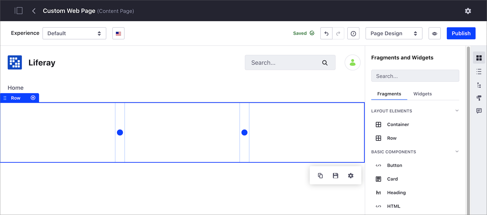
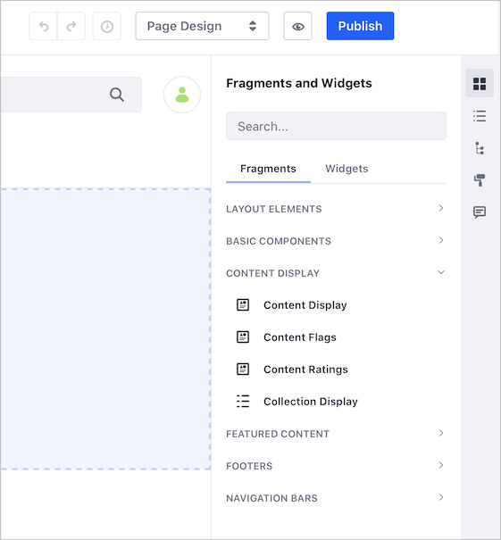
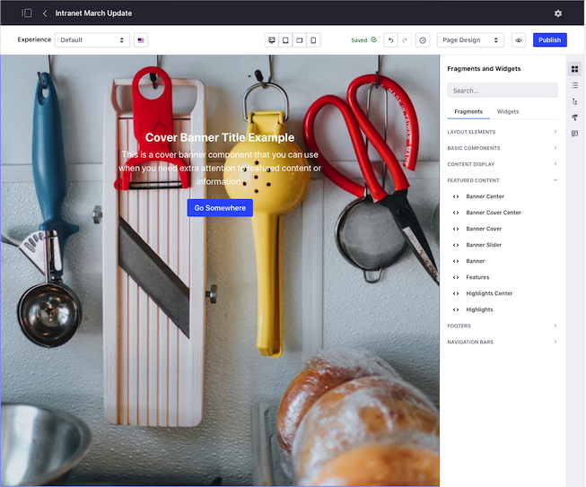

# コンテンツページの概要

Liferay DXPで使用されるデフォルトのページタイプはコンテンツページです。 コンテンツページ編集UIを使用すると、最小限の構成ですぐに使用できるさまざまなドラッグアンドドロップ要素（フラグメント）にアクセスできます。 続きを読み進め、コンテンツページUIの概要を確認してください。 コンテンツページの作成に直接移動するには、[Building Content Pages](./building-content-pages.md)を参照してください。



コンテンツページのサイドバーには、コンテンツページ用の次の要素とツールが含まれています。

  - [フラグメント](#fragments)
  - [ウィジェット](#widgets)
  - [コンテンツ](#contents)
  - [ページ構造](#page-structure)
  - [ルックアンドフィール](#look-and-feel)
  - [コメント](#comments)

Liferay Portalには、ページの作成に使用できるいくつかのレイアウト、フラグメント、およびウィジェットが付属しています。 開発者は、[独自のフラグメントを作成](../../displaying-content/using-fragments/using-page-fragments.md)してこれらに追加できます。

## フラグメント

<!-- ```note::
   Available in Liferay DXP 7.3+. This panel was previously divided between the *Sections* and *Section Builder* panels.
``` -->

> 入手可能：Liferay 7.3以降。以前は *セクション* と *セクションビルダー* パネルに分割されていました。
ページにフラグメントをドラッグアンドドロップできます。 フラグメントには、[テキスト](./building-content-pages.md#editing-text)、[画像](./building-content-pages.md#editing-an-image)、[リンク](./building-content-pages.md#editing-a-hyperlink)などの編集可能な要素を含めることができ、カスタムコンテンツで置き換えることができます。 サイト自体ですでに利用可能なコンテンツに[これらの要素をマッピング](./building-content-pages.md#mapping-content)することもできます。 これらの要素の開発の詳細については、[Fragment Specific Tags](../../displaying-content/using-fragments/using-page-fragments.md)を参照してください。
### レイアウト要素

<!-- ```note::
  In Liferay Portal CE 7.3 GA2+ this panel is called Layout Elements. Previously this panel was called Layouts and contained layout options with preconfigured panels and rows.
``` -->

> 利用可能：Liferay Portal CE 7.3 GA2 +;以前はレイアウトと呼ばれ、事前設定されたパネルと行を含むレイアウトオプションが含まれていました。
レイアウト要素パネルには2つのフラグメントが含まれています。
- セクション：行を含めることができるコンテナフラグメント。 追加するセクションごとに、ページの幅が埋められます。 セクションには、複数の行を重ねて含めることができます。
- 行：フラグメントまたはウィジェットを追加できる列のセットを含むフラグメント。 行を別の行内にネストして、より複雑なレイアウトを作成できます。 あなたは、することができます [の間隔調整](./building-content-pages.md#configuring-a-row-s-columns) 新しいデザインを作成するために、行の列のを。
![[レイアウト]パネルには、フラグメントを整理するためのレイアウトが含まれています。](content-pages-overview/images/16.png)
### 基本コンポーネント
基本コンポーネントは、ページに機能を追加する小さなデザイン要素または部品です。 コンポーネントには、フォーマットが設定された画像や、スタイルが事前に適用されたテキストのブロックなどがあります。 コンポーネントが連携して、ページを1つずつ構築します。

### 注目コンテンツ
[Featured Content]パネルには、（複数のコンポーネントで構成される）完全なフラグメントが含まれており、ページに追加するとすぐに使用およびカスタマイズできます。 テキストオーバーレイとカスタマイズ可能なCTA（Call to Action）が設定された大きなバナー画像は、すぐに使用できる状態のフラグメントの例です。

<!-- An image with better text contrast would probably be a better example here - to help the image / text / CTA button stand out from one another more. -->

![コンテンツページの編集中に[Banner]という名前のセクションが表示されます。](./content-pages-overview/images/01.png)
### フッター

<!-- ```note::
   Available in Liferay DXP 7.3+. These Fragments were previously included in the *Sections* panel.
``` -->

> 利用可能：Liferay DXP 7.3以降;以前は *Sections* パネルに含まれていました。
*[Footers]* パネルには、ページのフッターとして追加できるフラグメントが含まれています。 Liferay DXP 7.3での使用については、[Master Pages](../defining-headers-and-footers/master-page-templates.md)を参照してください。
### ナビゲーションバー

<!-- ```note::
   Available in Liferay DXP 7.3+. These Fragments were previously included in the *Sections* panel.
``` -->

> 利用可能：Liferay DXP 7.3以降;以前は *Sections* パネルに含まれていました。
*[Navigation Bars]* パネルには、ページのヘッダーとして追加できるフラグメントが含まれています。 Liferay DXP 7.3での使用については、[Master Pages](../defining-headers-and-footers/master-page-templates.md)を参照してください。
### コンテンツ表示

<!-- ```note::
   Available in Liferay DXP 7.3+.
``` -->

> 対応可能：Liferay DXP 7.3以降
*Content Display* パネルからコンテンツ表示フラグメントを追加することにより、単一の既存のWebコンテンツ、ブログエントリ、またはドキュメントを表示できます。 詳細については、[Using the Content Display Fragment](./README.md#using-fragments)を参照してください。
## ウィジェット
ウィジェットパネルには、ページに追加できる、すぐに使用できるアプリケーションとツールが一覧表示されます。 コンテンツページでのウィジェットの使用にはいくつかの制限があります。 詳細については、「 [コンテンツページでのウィジェットの使用](./using-widgets-on-a-content-page.md) 」を参照してください。


``` note::
  While portlets are rendered according to `render-weight <https://docs.liferay.com/ce/portal/7.3-latest/definitions/liferay-portlet-app_7_3_0.dtd.html#render-weight>`_ on Widget Pages, that is not true for Content Pages. Portlets are rendered in the order they appear on the page on Content Pages (i.e. left to right, top to bottom).
```

## コンテンツ

<!-- ```note::
   Available in Liferay DXP 7.3+
``` -->

> 対応可能：Liferay DXP 7.3以降

[コンテンツ]パネルには、ページで使用されているWebコンテンツのリストが表示されます。 ウィジェットに表示されるコンテンツやコンテンツフィールドにマップされたコンテンツなどがあります。 *コンテンツ*ボタン（）をクリックして、[Contents]パネルを開きます。 このパネルから、さまざまなアクションを実行して、Webコンテンツを編集および管理できます。 詳細については、[Managing Web Content on Content Pages](./managing-web-content-on-content-pages.md)を参照してください。

## ページ構造

ページ構造は、ページ上のフラグメントとそのコンテンツの階層ビューを提供します。 ページ構造のフィールドをクリックして、ページ上で強調表示します。 ヘッダーとフッターは、カスタム [マスターページテンプレート](../defining-headers-and-footers/master-page-templates.md)の階層にも表示されますが、マスターページテンプレートからのみ変更できるため、無効になっています。

![[Page Structure]では、ページの階層が表示されます。](./content-pages-overview/images/08.png)

## ルックアンドフィール

*ルックアンドフィール*アイコン（）をクリックして、テーマを変更したり、ページの他のオプションを管理したりします。 これらのオプションについては、[Configuring Individual Pages](../page-settings/configuring-individual-pages.md#look-and-feel)でさらに詳しく説明します。

## コメント

ページフラグメントにコメントして、変更について議論したり、コラボレーションすることができます。 Liferay DXP 7.2以降では、コメントはデフォルトで無効になっていますが、管理者はコメントを有効にできます。 詳細については、[Using Fragment Comments](./using-fragment-comments.md)を参照してください。

## ワークフロー

LiferayのポータルCE 7.3 GA2のとおり、 [ワークフロー](./building-content-pages.md) コンテンツページのためにサポートされています。

## 関連情報

  - [コンテンツページの構築](./building-content-pages.md)
  - [ページフラグメント](../../displaying-content/using-fragments/using-page-fragments.md)
  - [フラグメントコメントの使用](./using-fragment-comments.md)
