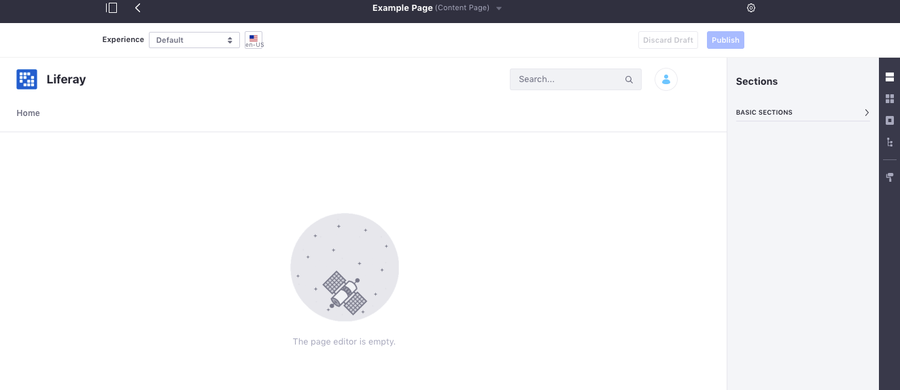
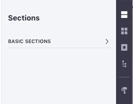
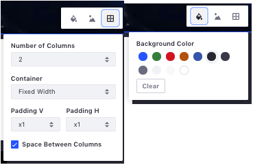
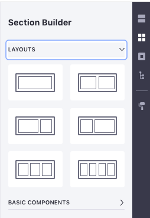
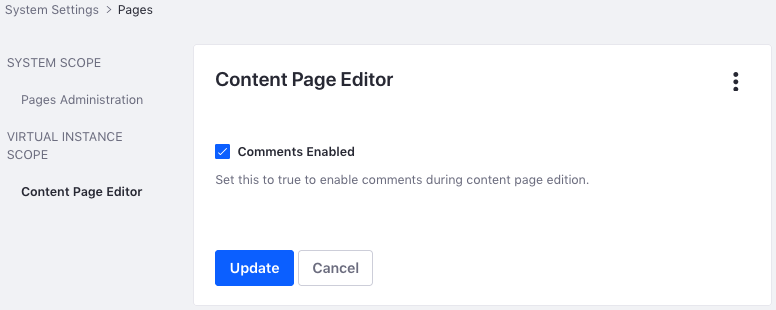
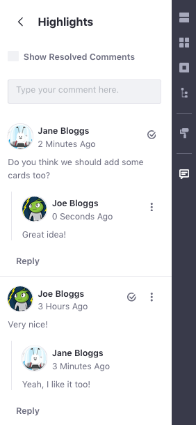

# コンテンツページの編集

``` note::
   Liferay DXP 7.3以降。 以前のLiferay DXPのバージョンについては、 `Liferay DXP 7.1 and 7.2 <#liferay-dxp-7-1-and-7-2>`_ を参照してください。
```

コンテンツページは、表示、管理、および作成が簡単です。 これらのオプションにアクセスするには、 *アプリケーションバー*の右上にある*編集* アイコン（）をクリックします。 編集ツールバーとサイドバーが表示され、コンテンツページを作成するためのツールやコンポーネントが表示されます。

  - [編集ツールバー](#editing-toolbar)
  - [編集サイドバー](#editing-sidebar)

![[編集する]をクリックして、コンテンツページの編集ツールバーとサイドバーにアクセスします。](./editing-content-pages/images/01.png)

## 編集ツールバー

コンテンツページのツールバーには、独自のユーザーエクスペリエンスの作成、ローカライズされた翻訳の設定、編集モードの切り替えなどのツールが含まれています。

![[編集する]をクリックして、コンテンツページのツールバーにアクセスします。](./editing-content-pages/images/02.png)

### エクスペリエンス

*[エクスペリエンス]* ドロップダウンメニューを使用して、現在のページのコピーを作成し、特定のオーディエンス向けにカスタマイズできます。 詳細は、[コンテンツページのパーソナライゼーション](../../personalizing-site-experience/experience-personalization/content-page-personalization.md)を参照してください。

### 翻訳

*言語フラグ*をクリックして、翻訳ドロップダウンメニューにアクセスします。 ここでは、ページのアクティブな言語のステータスを表示したり、言語を切り替えて翻訳を直接表示および編集したりできます。 詳細は、[サイト言語の設定](../../site-settings/site-localization.md)を参照してください。

### デバイスディスプレイ

デバイスアイコンをクリックして、DXPのレスポンシブレイアウトエディターにアクセスします。ここで、コンテンツページがデスクトップ、タブレット、およびスマートフォンでどのように表示されるかを表示および設定できます。

### 編集履歴

履歴アイコン（）をクリックして、現在の編集セッション中にコンテンツページに加えた変更を表示します。 元に戻すボタンとやり直しボタンを使用して、これらの変更を元に戻したり復元したりできます。

### 編集モードセレクター

編集モードのドロップダウンメニューをクリックして、*コンテント編集*モードと*ページデザイン*モードから選択します。 各モードによって、編集サイドバーメニューでアクセスできるパネルが決まります。 [コンテント編集]では、[選択](#selection)（）、[コンテンツ](#contents) （）、および[コメント](#comments)（）パネルにアクセスできます。 ページデザインでは、[フラグメントとウィジェット](#fragments-and-widgets)（）や [ページデザインオプション](#page-design-options)（）にもアクセスできます。

### プレビューと公開

変更を加えたら、*プレビュー*アイコン（）をクリックして、ページの公開ビューを表示します。 変更をプレビューしながら、表示するエクスペリエンス、言語、およびデバイスレイアウトを選択できます。 完了したら、* [Publish]* をクリックします。 デフォルトでは、公開すると変更がすぐに公開されます。 ただし、カスタム[ワークフロー](../../../process-automation/workflow/introduction-to-workflow.md)を有効にしてレビューと公開のプロセスを指示している場合は、[Publish]をクリックすると定義済みの手順が開始されます。

## 編集サイドバー

選択した編集モードに応じて、編集サイドバーで次のオプションにアクセスできます。

  -  - [フラグメントとウィジェット](#fragments-and-widgets)
  -  - [選択](#selection)
  -  - [コンテンツ](#contents)
  -  - [ページデザインオプション](#page-design-options)
  -  - [コメント](#comments)

![[編集する]をクリックして、コンテンツページのサイドバーメニューにアクセスします。](editing-content-pages/images/03.png)

### フラグメントとウィジェット

フラグメントとウィジェットサイドバーパネル（  ）では、ページを作成するために、すぐに使用できるページ要素とカスタムページ要素の両方にアクセスできます。

  - **フラグメント**：フラグメントは、コンテンツページの主要な構成要素として機能する、拡張可能で再利用可能なドラッグアンドドロップ要素です。 例としては、レイアウト要素、ビデオ、テキストオーバーレイ付きのバナー画像などがあります。 DXPのすぐに使えるフラグメントの詳細は[フラグメントの使用](./using-fragments.md) を、独自のフラグメントを作成する方法については[Developing Fragments](../../developer-guide/developing-page-fragments/developing-fragments-intro.md)を参照してください。

  - **ウィジェット**：他のDXPコンテキストと同様に、ウィジェットはページに動的機能を追加する[アプリケーション](../../../developing_applications.html)です。 例としては、ブログ、掲示板、カレンダーなどがあります。 詳細は、[Using Widgets on Content Pages](./using-widgets-on-a-content-page.md)を参照してください。

### 選択

選択サイドバーパネル（）では、すべてのページ要素の階層アウトラインを表示したり、それらの要素を選択、設定、または削除したりできます。 同様に、デザインモードでページ上の任意の要素をクリックすると、選択パネルが開き、階層内の選択されたページ要素が強調表示されます。 要素を選択すると、その要素に[一般]、[スタイル]、および[リンク]オプションがある場合はそれらにアクセスできます。 詳細は、[フラグメントの使用](./using-fragments.md)を参照してください。


``` note::
   ページのヘッダーとフッターは、選択パネルの階層の一部として表示されません。 これは、`マスターページテンプレート <../defining-headers-and-footers/master-page-templates.md>`_ からしか変更できないためです。
```

### コンテンツ

ここでは、ページ上のすべてのWebコンテンツを表示、編集、および管理できます。 ウィジェットに表示されるコンテンツやコンテンツフィールドにマップされたコンテンツなどがあります。 詳細は、[Managing Web Content on Content Pages](./managing-web-content-on-content-pages.md)を参照してください。

### ページデザインオプション

*ルックアンドフィール*アイコン（）をクリックして、テーマを変更したり、ページの他のオプションを管理したりします。 これらのオプションの詳細は、[Page Configuration UI Reference](../page-settings/page-configuration-ui-reference.md#look-and-feel)を参照してください。

### コメント

ページフラグメントコメントを使用して、チームメンバーと協力しながらコンテンツページを作成できます。 作成したら、コンテンツページサイドバーのコメントパネル（）で、開いているコメントを表示、編集、削除、または返信できます。 [メンション](../../../collaboration-and-social/notifications-and-requests/user-guide/mentioning-users.md)が有効になっている場合は、コメントの一部としてページ更新権限を持つユーザーにタグを付けることができます。

``` note::
   7.3以降のバージョンでは、コメントはデフォルトで無効になっています。 ページコメントを有効にするには、*コントロールパネル*→*設定*→*システム設定*→*ページ*→*コンテンツページエディタ*に移動します。 次に、*コメントを有効にする*チェックボックスをオンにして、*アップデート*をクリックします。
```

## Liferay DXP 7.1および7.2

ウィジェットページとは異なり、コンテンツページはサイトビルダーを介してのみ編集でき、本番環境でページ上で編集することはできません。 ページに対して行った編集は、ページを公開するまで下書きとして保存されます。 最初の公開後のその後の変更は、ページが再度公開されるまで、本番環境ページに影響を与えることなく、下書きとして再度保存されます。

### コンテンツページの作成

1.  *[Site Management]* → *[サイトビルダー]* → *[Pages]* に移動します。

2.  をクリックします。

3.  次のページで、*[コンテンツページ]* を選択し、ページの名前を入力します。

    次に、コンテンツページ管理インターフェイスに移動します。

    

既存のコンテンツページを編集するには、

1.  *[サイト管理]* → *[サイトビルダー]* → *[Pages]* に移動します。

2.  編集するコンテンツページの横にある*アクション*（）→ *[編集する]* をクリックします。

公開されたコンテンツページを表示している場合は、コントロールメニューから*編集*ボタン（）を選択してこのページにアクセスすることもできます。

ここでは、ページのプレビューを表示したり、フラグメントとウィジェットを追加したり、ページまたは現在ページに存在するフラグメントとウィジェットの設定を管理したりできます。

ページを作成するためのツールはすべて、ページの右側にあります。 上から下へ、オプションは次のとおりです

  - [セクション](#sections)
  - [セクションビルダー](#section-builder)
  - [ウィジェット](#widgets)
  - [ページ構造](#page-structure)
  - [ルックアンドフィール](#look-and-feel)

### セクション

ここに、使用可能なコレクションのリストが表示されます。 最初は、製品に含まれている基本セクションコレクションしかありません。 コレクションを開いて、セクションをページに直接ドラッグできます。



セクションがページに追加されると、その背景色、背景画像、および間隔を編集できます。 これらのオプションはページエディターで使用できるため、オプションは限られており、フラグメント開発者はカラーパレットを設定できます。



### セクションビルダー

ここでは、レイアウトと基本コンポーネントから始めます。 ページにレイアウトを追加して、コンポーネントを追加できるスペースを確保します。



### ウィジェット

[Widgets]セクションは、 	ウィジェットページの*[Add]* メニューと同様に機能します。 使用可能なウィジェットの完全なリストが表示され、それらをページに追加できます。

![[Widgets]セクションには、レイアウト内に追加できるウィジェットのリストが表示されます。](./editing-content-pages/images/24.png)

主な違いは、コンテンツページのウィジェットで使用できるのは主要な設定オプションのみという点です。 *ルックアンドフィール*のような他の様々な設定は、ウィジェットページのウィジェットに対してのみ利用できます。

### ページ構造

[ページ構造]には、ページ上の各フラグメント内のすべてのフラグメントとフィールドの概要ビューが表示されます。

![[ページ構造]では、ページの階層が表示されます。](./editing-content-pages/images/25.png)

ページ構造でフィールドを選択すると、ページ上でそのフィールドが強調表示されます。 大きくて複雑なページでは、何かを見つける場合に役立ちます。

### ルックアンドフィール

*ページデザインオプション*アイコン（）をクリックして、テーマを変更したり、ページの他のオプションを管理したりします。 これらのオプションについては、[Creating Pages](../../creating_pages.rst)で詳しく説明しています。

### コメント

また、任意のページフラグメントにコメントすることもできます。 これにより、コンテンツページを作成するチームのディスカッションとコラボレーションが可能になります。

コメントはデフォルトで無効になっていますが、管理者は *[コントロールパネル]* → *[設定]* → *[システム設定]* → *[Pages]* → *[コンテンツページエディタ]* からコメントを有効にできます。 *[コメントを有効にする]* チェックボックスを選択し、*[アップデート]* をクリックします。 これにより、すべてのインスタンスのコンテンツページへのコメントが有効になります。 これをインスタンスごとに制御するには、*[Instance Settings]*（システム設定ではなく） で同じ設定に移動します。



コメントが有効になっている場合は、コメントアイコン（）からコメントにアクセスできます。 選択したフラグメントのコメントが表示されます。 フラグメントのコメントUIで次のアクションを実行できます。

  - 新しいコメントを追加し、既存のコメントに返信します。
  - それぞれのチェックボックスをクリックしてコメントを解決します。 コメントを解決すると、*[解決済みコメントの表示]* が選択されていない限り、コメントは非表示になります。
  - 自分のコメントの編集や削除は、それぞれのアクションボタン（）から行います。

フラグメントの選択を解除するか、フラグメントを選択せずにコメントUIに入ると、ページ上のフラグメントのリストが、それぞれのコメント数とともに表示されます。 フラグメントを選択すると、そのコメントが表示されます。



### タイトルバー

タイトルバーは、メインメニューに戻るナビゲーション、ページ設定へのリンク、および他のページを検索する機能を提供します。 タイトルバーについては、[Creating Pages](../../creating_pages.rst)で詳しく説明しています。


これで、コンテンツページインターフェイスの使用方法がわかりました。

## 追加情報

  - [コンテンツページの構築](./building-content-pages.md)
  - [Page Fragments](../../displaying-content/using-fragments/using-page-fragments.md)
  - [Using Fragment Comments](./using-fragment-comments.md)
