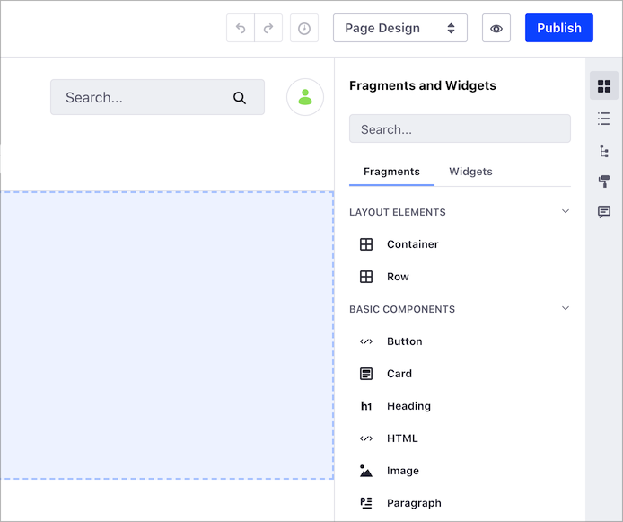

# マスターページテンプレートの作成

> 対応可能：Liferay DXP 7.3以降

ポータルには、サイトのページのヘッダーとフッターのルックアンドフィールを定義するために使用できるデフォルトのマスターページテンプレートが含まれていますが、さらにカスタムソリューションが必要になる場合があります。 このためのカスタムマスターページテンプレートを作成できます。

マスターページテンプレートを作成するには、次の手順に従います。

1.  製品メニューを開き、Site→ *Site Builder* → *Page Templates*ます。

2.  [ *マスター* ]タブで、追加ボタンをクリックして新しいマスターページテンプレートを作成します。

    ![ [マスター]タブでマスターページテンプレートを作成します。](./creating-a-master-page-template/images/01.png)

3.  必要な共通要素のページフラグメントを追加します。

    

4.  必要に応じて、ドロップゾーンをレイアウト内の新しい場所にドラッグアンドドロップします。 たとえば、2列の行を追加してドロップゾーンを1列に移動すると、ユーザーはページのその部分にのみページフラグメントを追加できます。

    

5.  必要に応じて、[ *許可するフラグメントの構成* ]ボタンをクリックして、ドロップゾーンに追加できるページフラグメントを指定します。 許可するページフラグメントのボックスをオンにします。 新しいページフラグメントをドロップゾーンに追加できるようにするには、[ *Allow New Fragments* ]のチェックボックスをオンにします。 *[保存]* をクリックして変更を適用します。

    ![[許可されたフラグメント]ダイアログの [フラグメント]をオンまたはオフにして、このマスターページテンプレートを使用するページに追加できるかどうかを指定します。](./creating-a-master-page-template/images/04.png)

6.  [発行]をクリックして、マスターページテンプレートを作成します。

<!-- end list -->

```{note}
If a custom Master Page Template is used for a page, the Theme for the page is defined through the Master Page Template and can't be changed through the page's settings. See [Changing a Master Page Template's Theme](./managing-master-pages.md#changing-a-master-page-template-s-theme) for more information.
```
