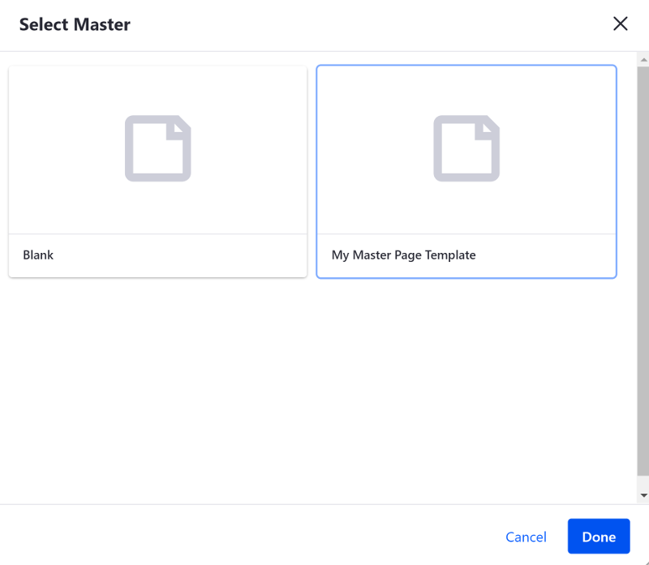
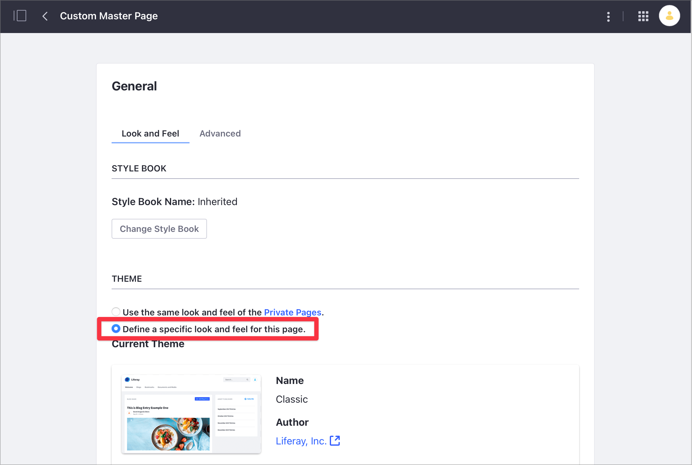

# マスターページテンプレートの管理

> 対応可能：Liferay DXP 7.3以降

マスターページテンプレートを管理するには、次の手順に従います。

1.  製品メニューを開き、[サイト]メニューの[ *Site Builder* → *Page Templates* ]に移動し、[ *Masters* ]タブを選択します。

    ![ページテンプレートアプリケーションの [マスター]タブからマスターページテンプレートを管理します。](./managing-master-pages/images/01.png)

2.  マスターページテンプレートの[アクション]メニューを開き、以下にリストされているオプションのいずれかを選択します。

      - **編集：** マスターページテンプレートを構成します。 または、[ *Edit Master* ]ボタンをクリックして、ページの [*Look＆Feel* メニュー](../building-and-managing-content-pages/content-pages-overview.md#look-and-feel) からページのマスターページテンプレートを編集することもできます。

      - **サムネイルの変更：** [ *マスター* ]タブでマスターページテンプレートのカードに表示するサムネイル画像を選択します

      - **名前の変更：** マスターページテンプレートの名前を変更します

      - **コピーを作成します** マスターページテンプレートを複製します。 コピーには、元のマスターページテンプレートの後に「コピー」が追加された名前が自動的に付けられます。

      - **権限：** マスターページテンプレートの権限を定義します

      - **削除：** マスターページテンプレートを削除します。 各テンプレートのチェックボックスをオンにして `X`をクリックするか、管理ツールバーから *削除* アクションを選択して、マスターページテンプレートを一括削除することもできます。

<!-- end list -->

```{note}
After changes are made and published, they are propagated to all pages that use the Master Page Template.
```

## ページのマスターページテンプレートの変更

ページのマスターページテンプレートは、ページの [*ルック＆フィール*メニュー](../building-and-managing-content-pages/content-pages-overview.md#look-and-feel) から変更することができます。 次の手順を実行します：

1.  マスターページテンプレートを変更するページに移動します。

2.  *Look＆Feel* アイコン（）をクリックします。

3.  [ *Look＆Feel* ]タブの下の[ *Change Master* ]ボタンをクリックします。

    ![ [マスターの変更]ボタンをクリックして、別のマスターページテンプレートを選択します。](./managing-master-pages/images/03.png)

4.  新しいマスターページテンプレートを選択し、[ *完了*]をクリックします。 [ *保存* をクリックして変更を適用します。

    

## マスターページテンプレートのテーマの変更

カスタムマスターページテンプレートがページに適用されると、テーマはページを通じて定義されなくなります。 マスターページテンプレートで定義されます。 次の手順に従って、マスターページテンプレートのテーマを更新します。

1.  上記のように、[アクション]メニューからマスターページテンプレートを編集します。

2.  ページの *Look＆Feel* メニュー（）を開きます。

3.  [ *このページ* 特定の外観を定義する]ボタンを選択します。

    

4.  下にスクロールして[ *現在のテーマを変更* ]ボタンをクリックし、新しいテーマを選択して、[ *保存* ]をクリックして変更を適用します。
